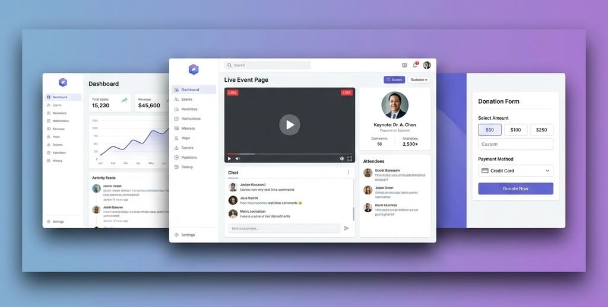

# Fundraising Event Project



This repository contains the codebase for the **Fundraising Event** application, a platform designed to manage and display live fundraising events with real-time updates.

## 🤖 For AI Agents & Developers

> [!IMPORTANT]
> **CRITICAL:** Please read the **Developer Guidelines** before contributing or starting a task. These guidelines define our "Prime Directive," coding standards, and agent behavior.
> 👉 [Developer Guidelines (agent/agents.md)](agent/agents.md)

## 🚀 Getting Started

Follow these steps to get your development environment up and running.

### 1. Prerequisites

- **Node.js**: v20+
- **pnpm**: v9+ (`npm install -g pnpm`)
- **Docker**: For running infrastructure (Postgres, Redis).

### 2. Installation

Install dependencies for the entire monorepo:

```bash
pnpm install
```

### 3. Environment Configuration

Copy the example environment files and configure them:

**Root (for Docker Infra):**

```bash
cp .env.example .env
```

**API (`apps/api`):**

```bash
cp apps/api/.env.example apps/api/.env
```

**Web (`apps/web`):**

```bash
cp apps/web/.env.example apps/web/.env
```

> [!TIP]
> Refer to [Configuration Docs](docs/technical/configuration.md) for detailed environment variable descriptions.

### 4. Running the Project

**Start Infrastructure (Postgres & Redis):**

```bash
docker compose --profile infra up -d
```

**Start Applications (Development Mode):**
This will start both the NestJS API and the React Frontend concurrently.

```bash
pnpm dev
```

- **API**: http://localhost:4000
- **Web**: http://localhost:5173

## 📚 Documentation

Detailed documentation is available at: **[https://Mouness.github.io/fundraising-event/](https://Mouness.github.io/fundraising-event/)**

Detailed documentation is also available in source form in the `docs/` directory.

### Technical Documentation

- **[Architecture](https://Mouness.github.io/fundraising-event/technical/architecture/)**: System design and component overview.
- **[API Reference](https://Mouness.github.io/fundraising-event/technical/api-reference/)**: Endpoints and usage.
- **[Configuration](https://Mouness.github.io/fundraising-event/technical/configuration/)**: Environment setup details.
- **[White-Labeling](https://Mouness.github.io/fundraising-event/technical/white-labeling/)**: Customization and branding options.

### User Guides

- **[Introduction](https://Mouness.github.io/fundraising-event/user/en/)**: User onboarding guide.
- **[Event Management](https://Mouness.github.io/fundraising-event/user/en/events/)**: How to create and manage events.
- **[Live Mode](https://Mouness.github.io/fundraising-event/user/en/live/)**: Real-time display features.

## 📁 Project Structure

The project is organized as a pnpm monorepo:

- **`apps/`**
    - **[`api`](apps/api)**: NestJS backend service.
    - **[`web`](apps/web)**: React + Vite frontend application.
- **`packages/`**
    - **[`dto`](packages/dto)**: Shared Data Transfer Objects.
    - **[`white-labeling`](packages/white-labeling)**: Shared logic for theming and i18n.
- **`agent/`**: AI Agent specific documentation and specifications.
- **`deploy/`**: Dockerfiles and deployment scripts.
- **`docs/`**: Project documentation (Markdown).

## 🧪 Testing

Run tests across the monorepo:

```bash
# Unit Tests
pnpm test

# E2E Tests
pnpm test:e2e
```

## 🔗 Project Links

- **Repository**: [github.com/Mouness/fundraising-event](https://github.com/Mouness/fundraising-event)
- **Issues**: [github.com/Mouness/fundraising-event/issues](https://github.com/Mouness/fundraising-event/issues)
- **Pull Requests**: [github.com/Mouness/fundraising-event/pulls](https://github.com/Mouness/fundraising-event/pulls)

## 📜 License

This project is licensed under the MIT License.
