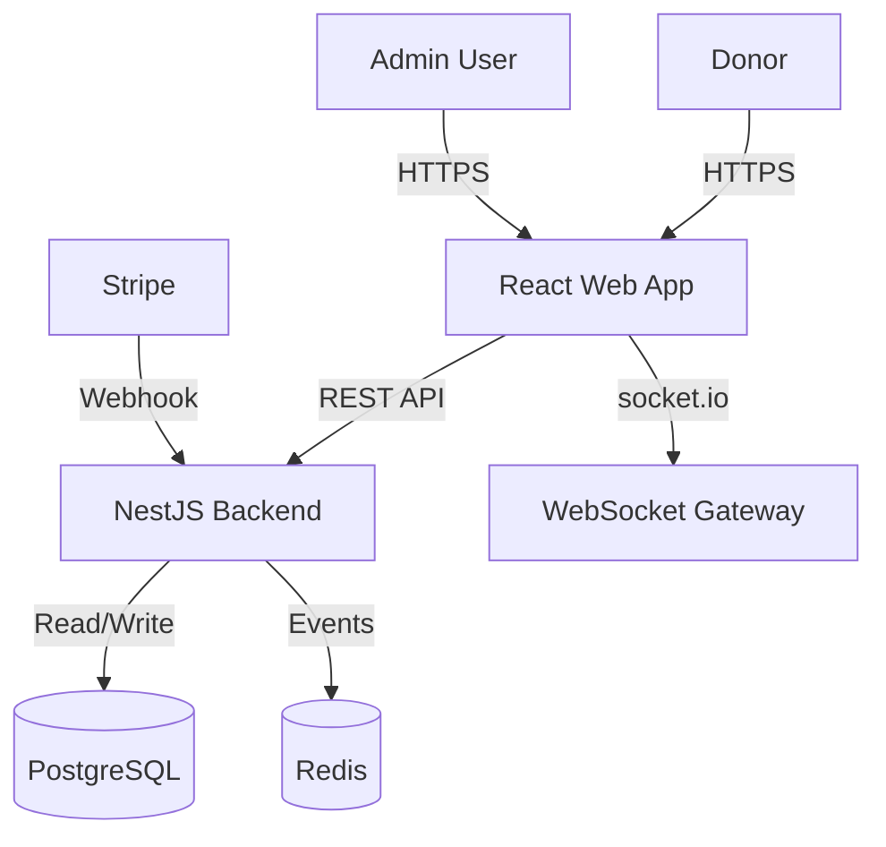

# Architecture Overview

The Fundraising Event platform uses a modern Monorepo architecture managed by `pnpm workspaces`.

## System Components

## Backend (`apps/api`)

Built with **NestJS**, following a modular architecture:

- **Modules**:
    - `AuthModule`: Handles JWT authentication and Login strategies.
    - `EventModule`: Manages event data and configuration.
    - `DonationModule`: Processes payments via Stripe and records transactions.
    - `LiveModule`: Manages real-time WebSocket connections.

- **Data Layer**:
    - **Prisma ORM**: Type-safe database access.
    - **PostgreSQL**: Primary data store.

- **Real-time**:
    - **Socket.IO**: Pushes new donation events to the Live Screen instantly.

## Frontend (`apps/web`)

Built with **React 19** and **Vite**:

- **State Management**: React Hooks & Context.
- **Styling**: Tailwind CSS v4 & Shadcn/UI for components.
- **Internationalization**: `react-i18next` for English/French support.
- **Forms**: `react-hook-form` + `zod` validation.

### Key Pages
1.  **Donation Page**: Public-facing form for donors.
2.  **Live Page**: Real-time dashboard for event screens (Projectors).
3.  **Admin Dashboard**: Restricted area for event management.

## Shared Packages

### `@fundraising/white-labeling`
A central library for handling configuration, assets, and themes. This package ensures that both the API and Web apps share the exact same configuration logic and type definitions, enabling true "White Label" capabilities where the core code remains agnostic of the specific event branding.

### `@fundraising/types` (Planned)
Shared DTOs and interfaces to ensure type compatibility between Frontend and Backend.
