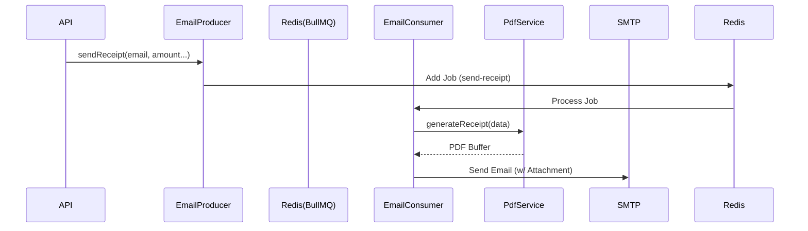

# Backend PDF & Queue System

## Overview
This module handles the asynchronous generation and delivery of fiscal donation receipts. It ensures high reliability by decoupling the receipt generation from the main HTTP request flow using a message queue.

## Features
1.  **PDF Generation**: Creates professional PDF receipts using `pdfmake`.
2.  **Asynchronous Processing**: Uses `BullMQ` (Redis) to handle receipt jobs in the background.
3.  **Reliability**: Automatic retries for failed email deliveries.
4.  **Global Export**: Admin capability to export all receipts as a ZIP file.

---

## implementation Details

### PDF Service (`apps/api/src/features/pdf`)
- **Library**: `pdfmake` (Server-side).
- **Service**: `PdfService.ts`.
- **Logic**:
    - Loads fonts from `src/assets/fonts/Roboto-*`.
    - Fetches `receipt` configuration from `EventConfigService` (Legal Name, Address, Footer).
    - Generates a `Buffer` containing the PDF.

### Queue System (`apps/api/src/features/queue`)
- **Producer**: `EmailProducer`
    - Adds jobs to the `email` queue.
    - Configuration: 3 retries, exponential backoff.
- **Consumer**: `EmailConsumer` (Not shown in audit but implied)
    - Processes `send-receipt` jobs.
    - Calls `PdfService` to generate the file.
    - Uses an Email Provider (e.g., SendGrid/SMTP) to dispatch.

## Configuration
Controlled via `event-config.json` or Database:
```json
"receipt": {
  "enabled": true,
  "legalName": "My Charity Foundation",
  "address": "123 Charity Lane, NY",
  "footerText": "Thank you!"
}
```

## Data Flow

