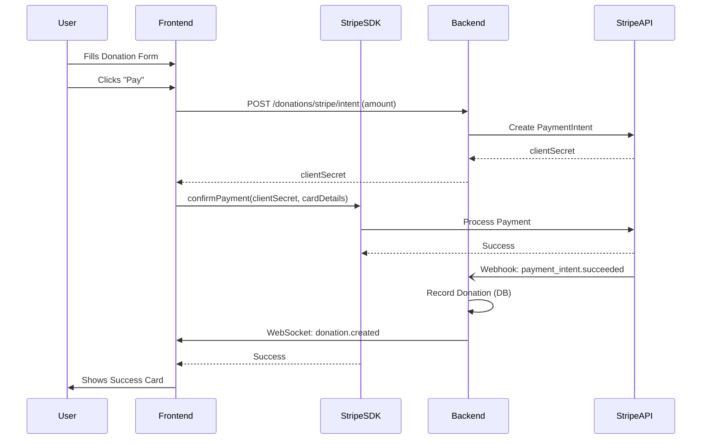

# Donation Flow & Stripe Integration

## Overview
The donation flow allows users to make payments using Stripe. It consists of a React frontend utilizing Stripe Elements and a NestJS backend handling Payment Intents and Webhooks.

## Architecture

### Backend (`apps/api`)
- **Module**: `DonationModule`
- **Service**: `StripeService`
  - Wraps Stripe SDK.
  - `createPaymentIntent`: Creates an intent (default currency: USD).
  - `constructEventFromPayload`: Verifies webhook signatures.
- **Controller**: `DonationController`
  - `POST /donations/stripe/intent`: Returns `clientSecret`.
  - `POST /donations/stripe/webhook`: Listens for `payment_intent.succeeded`.

### Frontend (`apps/web`)
- **Page**: `/donate` (`DonationPage.tsx`) maps to `CheckoutForm`.
- **Component**: `CheckoutForm.tsx`
  - Uses `@stripe/react-stripe-js`.
  - Collects Amount (custom or preset), Name, Email, Anonymous flag.
  - Submits to backend to get `clientSecret`.
  - Confirms payment via `stripe.confirmPayment`.
- **Validation**: Zod schema (`donation.schema.ts`).
- **i18n**: All text located in `donation` namespace in `common.json`.

## Flow Diagram



## Configuration
Required Environment Variables:
- **Backend**:
  - `STRIPE_SECRET_KEY`: Private API key.
  - `STRIPE_WEBHOOK_SECRET`: Webhook signing secret.
- **Frontend**:
  - `VITE_STRIPE_PUBLIC_KEY`: Public API key.

## Usage
1. User visits `/donate`.
2. Selects amount and fills details.
3. Clicks "Donate".
4. Success message shown upon completion.

## Setup Guide (Local Development)

### 1. Get API Keys (Stripe Dashboard)
1.  Log in to [Stripe Dashboard](https://dashboard.stripe.com/).
2.  Toggle **Test Mode** (orange toggle at top right).
3.  Go to **Developers** > **API keys**.
4.  Copy **Publishable key** (`pk_test_...`) → Add to `apps/web/.env` as `VITE_STRIPE_PUBLIC_KEY`.
5.  Copy **Secret key** (`sk_test_...`) → Add to `apps/api/.env` as `STRIPE_SECRET_KEY`.

### 2. Configure Webhook (Stripe CLI)
To test webhooks locally, use the Stripe CLI.

1.  **Install CLI** (if not installed):
    - macOS: `brew install stripe/stripe-cli/stripe`
2.  **Login**:
    ```bash
    stripe login
    ```
3.  **Forward Webhooks**:
    Run this command in a separate terminal to forward events to your local API:
    ```bash
    stripe listen --forward-to localhost:3000/donations/stripe/webhook
    ```
4.  **Get Webhook Secret**:
    The CLI will output a secret (`whsec_...`).
    - Copy this secret → Add to `apps/api/.env` as `STRIPE_WEBHOOK_SECRET`.

### 3. Verify
- Restart your backend (`pnpm run dev`).
- Trigger a test event:
  ```bash
  stripe trigger payment_intent.succeeded
  ```
- Check API logs for "PaymentIntent was successful!".
