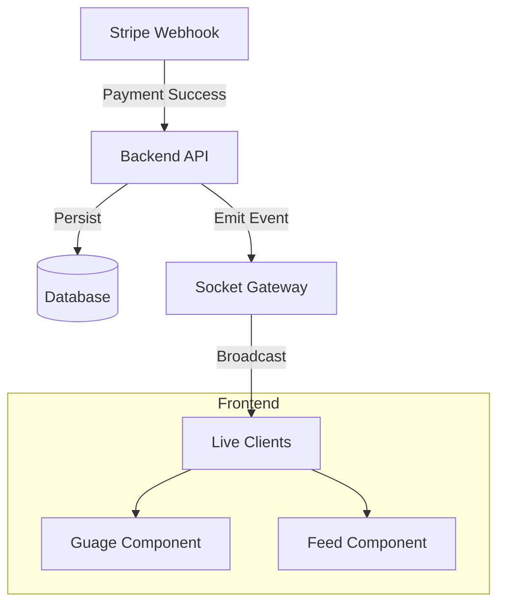

# Live Event & Real-Time Projection

## Overview
The Live Event feature is the public-facing "Projection Screen" typically displayed on large monitors during the fundraising event. It serves to:
1.  Visualize the fundraising goal and progress (Gauge).
2.  Display a real-time feed of incoming donations.
3.  Celebrate milestones with animations (Confetti).

## Feature Breakdown

### 1. Real-Time Updates
The screen connects to a WebSocket server to receive donation events instantly without page refreshes.
- **Frontend**: Connects via `socket.io-client`.
- **Backend**: Broadcasts events via `SocketGateway`.

### 2. Dynamic Configuration
The visual theme, goal amount, and labels are not hardcoded but loaded from the Event Configuration.
- **Source**: `event-config.json` (or default).
- **Adaptability**: Allows the same codebase to power different events (e.g., Gala vs. Charity Run).

---

## Implementation Details

### Frontend (`apps/web`)

#### Page & Components
- **`LivePage`** (`apps/web/src/features/live/pages/LivePage.tsx`):
  - The main container. Orchestrates the WebSocket connection and layout.
- **`DonationGauge`**: Visualizes `totalRaised / goalAmount`. Uses `react-countup` for numbers.
- **`DonationFeed`**: A scrolling list of recent donations using `framer-motion` for entrance animations.

#### Hooks
- **`useLiveSocket`**:
  - Manages the `socket.io` connection lifecycle.
  - Listens for `donation.created` events and updates the local state.
- **`useEventConfig`**:
  - Fetches the theme (colors) and content (titles) to style the page.

### Backend (`apps/api`)

#### WebSocket Gateway (`GatewayModule`)
- **Technology**: `socket.io`
- **Events**:
  - **`joinEvent`** (Client -> Server): Client subscribes to updates for a specific event room.
  - **`donation.created`** (Server -> Client): Broadcasted when a payment is confirmed.
    ```typescript
    payload: {
      amount: number; // cents
      donorName: string;
      message: string;
    }
    ```

#### Event Data (`EventModule`)
- **Model**: Stores the event's persistent data (Projected Goal, Slug).
- **API**: `GET /events/:slug` allows the frontend to validate the event exists (optional depending on config strategy).

## Architecture


