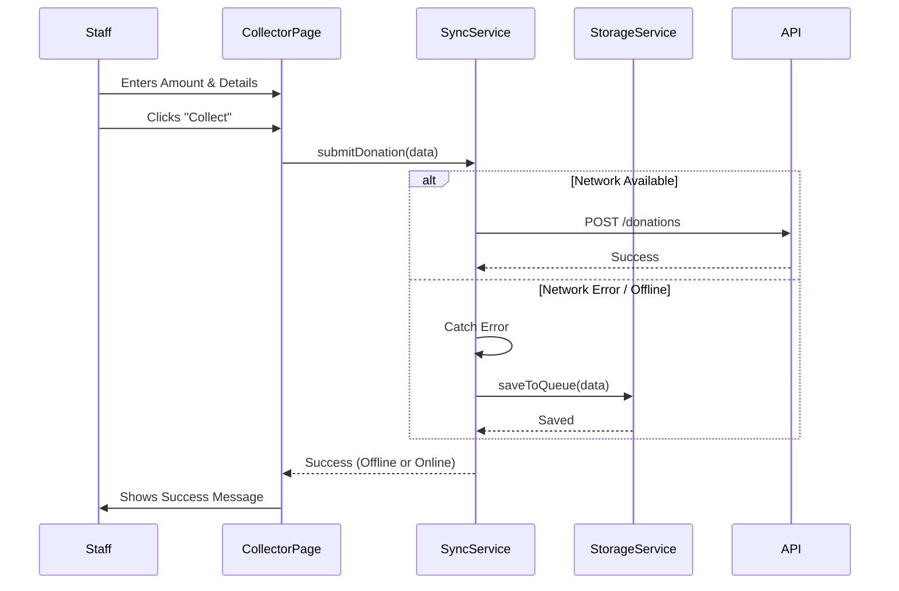

# Staff Offline Mode (Collector App)

## Overview
The Staff feature is designed for on-site volunteers and staff members to collect donations physically (cash, check, or assisted card entry). It prioritizes reliability, allowing operation in unstable network conditions via an Offline Queue.

## Feature Breakdown

### 1. Collector Interface
- **Keypad Entry**: Large, touch-friendly UI for quick amount entry.
- **Donation Types**: Toggles between Cash, Check, Pledge, and Other.
- **Donor Info**: Optional fields for Name and Email (for receipts).

### 2. Offline Synchronization
- **Queue**: Donations collected while offline are stored in `localStorage` via `StorageService`.
- **Sync**: When connectivity is restored, the `SyncService` pushes queued items to the API.
- **Feedback**: UI indicators show online/offline status and sync progress.

---

## Implementation Details

### Frontend (`apps/web`)

#### Page
- **`CollectorPage`** (`apps/web/src/features/staff/pages/CollectorPage.tsx`):
  - Main controller for the collector UI.
  - Handles keypad input state.
  - Integrates `SyncService` for submission.

#### Services
- **`SyncService.ts`**:
  - Handles `POST /donations` via the centralized `@/lib/api` client.
  - Catches network errors and delegates to `StorageService` for queuing.
  - `processQueue()`: Retries pending items when back online.
- **`StorageService.ts`**:
  - Wrapper around `localStorage` using "staff_donation_queue" key.
  - Methods: `saveToQueue`, `getQueue`, `removeFromQueue`.

#### Components
- **`Keypad`**: Reusable numeric input grid.
- **`DonationTypeSelector`**: Toggle buttons for payment method.

### Backend (`apps/api`)

#### Endpoints
- **`POST /donations`**:
  - Accepts `isOfflineCollected` flag.
  - Allows `collectedAt` timestamp override (to reflect actual collection time, not sync time).

## Data Flow (Offline)

