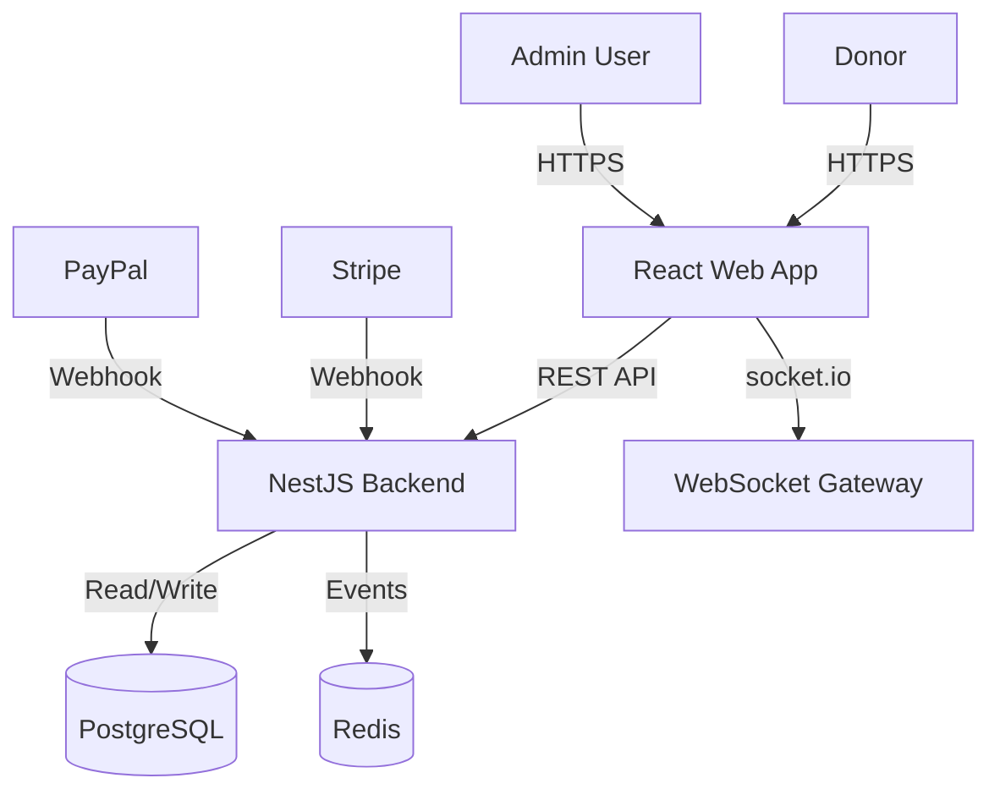
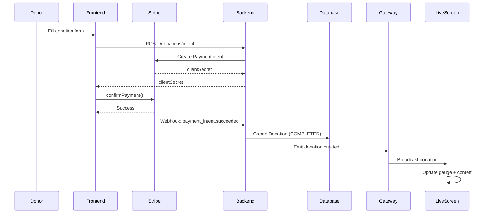

# Architecture Overview

The Fundraising Event platform uses a modern Monorepo architecture managed by `pnpm workspaces`.

## System Components



## Backend (`apps/api`)

Built with **NestJS**, following a modular architecture:

- **Modules**:
    - `AuthModule`: Handles JWT authentication and Login strategies.
    - `EventModule`: Manages event data and configuration.
    - `DonationModule`: Processes payments via Stripe/PayPal and records transactions.
    - `GatewayModule`: Manages real-time WebSocket connections.
    - `MailModule`: Email templates and sending.
    - `PdfModule`: Receipt PDF generation.
    - `QueueModule`: Background job processing with BullMQ.
    - `ExportModule`: Bulk data export (ZIP).
    - `HealthModule`: Health check endpoints.
    - `WhiteLabelingModule`: Configuration service integration.

- **Data Layer**:
    - **Prisma ORM**: Type-safe database access.
    - **PostgreSQL**: Primary data store.

- **Real-time**:
    - **Socket.IO**: Pushes new donation events to the Live Screen instantly.

## Frontend (`apps/web`)

Built with **React 19** and **Vite**, organized following a **Core vs Features** architecture to ensure scalability and maintainability:

- **Directory Structure**:
    - `src/core`: Houses universal infrastructure (API client, routing, global providers, shared UI components like `AppHeader` and `ui/` library).
    - `src/features`: Domain-specific logic organized by feature (e.g., `donation`, `admin`, `live`).
    - `src/test`: Global test utilities and integration tests.
- **Architectural Patterns**:
    - **Alias Standardization**: Uses `@core/*`, `@features/*`, and `@test/*` for clear dependency mapping.
    - **Context-First State**: Reusable global state managed via React Context providers (e.g., `AppConfigProvider`).
    - **Styling**: Tailwind CSS v4 & Shadcn/UI.
    - **Internationalization**: Full RTL/LTR support via `react-i18next`.

### Key Pages
1.  **Donation Page**: Public-facing form for donors.
2.  **Live Page**: Real-time dashboard for event screens (Projectors).
3.  **Admin Dashboard**: Restricted area for event management.

## Database Schema

The database is managed with **Prisma** and uses the following models:

```prisma
enum ConfigScope {
  GLOBAL
  EVENT
}

model Configuration {
  id               String      @id @default(uuid())
  scope            ConfigScope @default(GLOBAL)
  entityId         String?     // Null for GLOBAL, matches Event.id for EVENT
  
  // Identity
  organization     String?
  address          String?
  phone            String?
  logo             String?
  email            String?
  website          String?

  // JSON Blocks
  themeVariables   Json?       // Record<string, string>
  assets           Json?       
  event            Json?       
  form             Json?       
  communication    Json?       
  payment          Json?       
  socialNetwork    Json?       
  locales          Json?
  liveTheme        String?

  updatedAt        DateTime    @updatedAt
  @@unique([scope, entityId])
}

model Event {
  id            String   @id @default(uuid())
  slug          String   @unique
  name          String
  date          DateTime @default(now())
  description   String?
  goalAmount    Decimal
  status        String   @default("active") // active, draft, closed
  createdAt     DateTime @default(now())
  updatedAt     DateTime @updatedAt
  donations     Donation[]
  staffMembers  StaffMember[]
}

model StaffMember {
  id        String   @id @default(uuid())
  code      String   @unique // PIN code (global)
  name      String   // Name of the volunteer
  events    Event[]  // Many-to-many with Events
  donations Donation[]
  createdAt DateTime @default(now())
  updatedAt DateTime @updatedAt
}

model Donation {
  id            String   @id @default(uuid())
  amount        Decimal
  currency      String   @default("EUR")
  donorName     String?  // Null if anonymous
  donorEmail    String?
  message       String?  // Support message
  isAnonymous   Boolean  @default(false)
  status        String   // PENDING, COMPLETED, FAILED, CANCELLED, REFUNDED
  paymentMethod String   // STRIPE, PAYPAL, CASH, CHECK, PLEDGE
  transactionId String?  @unique // Payment provider transaction ID
  eventId       String
  event         Event    @relation(fields: [eventId], references: [id])
  staffMemberId String?
  staffMember   StaffMember? @relation(fields: [staffMemberId], references: [id])
  createdAt     DateTime @default(now())
  updatedAt     DateTime @updatedAt
}
```

### Key Schema Features

- **Configuration Model**: Stores platform-wide (GLOBAL) and event-specific (EVENT) settings
- **Flexible JSON Blocks**: Theme variables, form config, communication settings stored as JSON for flexibility
- **Staff Many-to-Many**: Staff members can work across multiple events
- **Transaction Tracking**: Generic `transactionId` field supports multiple payment providers

## Shared Packages

### `@fundraising/white-labeling`
A central library for handling configuration, assets, and themes. This package ensures that both the API and Web apps share the exact same configuration logic and type definitions, enabling true "White Label" capabilities where the core code remains agnostic of the specific event branding.

### `@fundraising/types`
Shared DTOs (Data Transfer Objects) and interfaces to ensure type compatibility between Frontend and Backend (e.g., `DonationDto`, `CreateEventDto`).

## Data Flow


