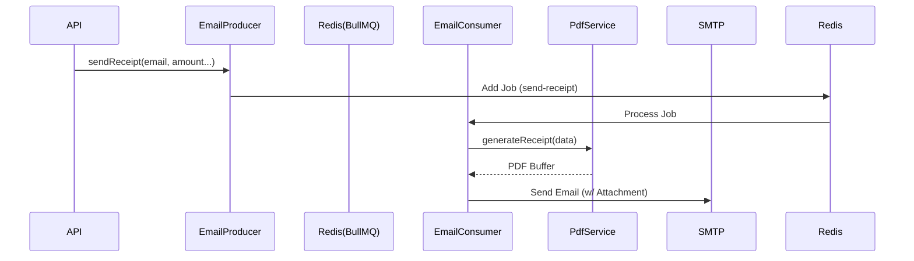

# Communication & Receipts (Email/PDF)

This module handles the asynchronous generation of fiscal donation receipts (PDF) and their delivery via email. It ensures high reliability by decoupling receipt generation from the main HTTP request flow using a message queue.

## Architecture

The system uses an event-driven architecture to handle receipts, ensuring high reliability and decoupling.

### 1. PDF Service (`apps/api/src/features/pdf`)

- **Library**: `pdfmake` (Server-side).
- **Service**: `PdfService.ts`.
- **Logic**:
    - Loads fonts from `src/assets/fonts/Roboto-*`.
    - Fetches `receipt` configuration from `EventConfigService` (Legal Name, Address, Footer).
    - Generates a `Buffer` containing the PDF.

### 2. Queue System (`apps/api/src/features/queue`)

- **Producer**: `EmailProducer`
    - Adds jobs to the `email` queue.
    - **Reliability**: Configured with **3 retries** and exponential backoff.
- **Consumer**: `EmailConsumer`
    - Processes `send-receipt` jobs.
    - Calls `PdfService` to generate the file.
    - Uses an Email Provider (e.g., Nodemailer/Resend) to dispatch.

### 3. Mail Service (`apps/api/src/features/mail`)

- **Service**: `MailService.ts`.
- **Pattern**: Uses **Strategy Pattern** to switch providers (Console, SMTP, Resend).

## Receipt Generation Flow



## Configuration

### 1. Email Provider

Configure the email provider via **Global Settings > Communication** in the Admin Panel.

- Supports **SMTP** (Gmail, Outlook, Custom) and **Resend**.
- Built-in white-labeling fetches event-specific branding (logo, colors) automatically.

### 2. PDF & Receipt Details

Controlled via `event-config.json` or Global Settings Database.

**Example Configuration:**

```json
"receipt": {
  "enabled": true,
  "legalName": "My Charity Foundation",
  "address": "123 Charity Lane, NY",
  "footerText": "Thank you for your support!",
  "taxId": "123-456-789"
}
```

### 3. Background Queues

Redis is **required** for the queue system.

- **Env Vars**: `REDIS_HOST`, `REDIS_PORT`.
- **Processor**: `EmailProcessor` (queue name: `email`).

## Key Features

### Tax Receipts

When a donation is completed, a `donation.created` event triggers a job in the `email` queue.

The `EmailProcessor` executes the following steps:

1.  **Fetch Config**: loads event-specific settings.
2.  **Generate PDF**: calls `PdfService.generateReceipt(context)`.
3.  **Render Email**: hydrates `src/features/mail/templates/receipt.html`.
4.  **Send**: dispatches the email with the named PDF attachment (e.g., `Receipt-12345.pdf`).

### Bulk Export

Admins can download all receipts for a specific event as a ZIP file.

- **Endpoint**: `GET /export/receipts/zip?eventId=...`
- **Mechanism**: `ExportService` generates all PDFs on the fly and streams them into a ZIP archive to keep memory usage low.

## Setup & Testing

1.  **Infrastructure**: Ensure Redis is running (`docker compose --profile infra up -d`).
2.  **Unit Tests**:
    ```bash
    pnpm --filter api test src/test/features/mail src/test/features/export
    ```
