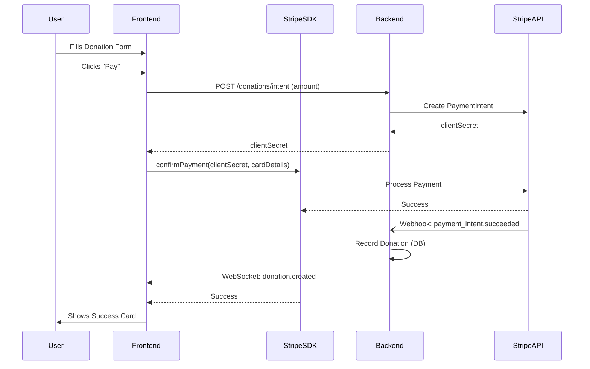

# Donation Flow & Stripe Integration

## Overview
The donation flow allows users to make payments using Stripe. It consists of a React frontend utilizing Stripe Elements and a NestJS backend handling Payment Intents and Webhooks.

## Architecture

### Backend (`apps/api`)
**Module**: `DonationModule`

**Service**: `StripeService`

  - Wraps Stripe SDK.
  - `createPaymentIntent`: Creates an intent (default currency: USD).
  - `constructEventFromPayload`: Verifies webhook signatures.

**Controller**: `DonationController`

| Method | Endpoint | Description | Auth |
|:---|:---|:---|:---|
| `POST` | `/donations/intent` | Returns `clientSecret` | Public |
| `POST` | `/donations/stripe/webhook` | Listens for `payment_intent.succeeded` | Stripe |
| `POST` | `/donations/paypal/webhook` | Listens for `CHECKOUT.ORDER.COMPLETED` | PayPal |
| `POST` | `/donations` | Handles offline/cash donations (Staff) | Staff |
| `GET` | `/donations` | List donations (with filters) | Admin |
| `GET` | `/donations/export` | Download CSV export of donations | Admin |
| `PATCH` | `/donations/:id` | Update donor details (Admin/Staff) | Admin/Staff |
| `POST` | `/donations/:id/cancel` | Cancel/Refund donation (Admin) | Admin |

### Frontend (`apps/web`)
**Page**: `/donate` (`DonationPage.tsx`) maps to `CheckoutForm`.

**Component**: `CheckoutForm.tsx`

  - Uses `PaymentFormFactory` to abstract provider implementation (Stripe).
  - Collects Amount, Name, Email.
  - **Optional Fields**: Phone, Address, Company, Message, Anonymous flag.
  - Submits to backend to get `clientSecret`.
  - **Refactor**: Strict typing for `sessionData` and `PaymentIntent` responses.

**Validation**: Zod schema (`donation.schema.ts`).

**i18n**: All text located in `donation` namespace in `common.json`.

## Flow Diagram

## Configuration & Setup

For detailed instructions on configuring Stripe and PayPal (both for production and local development), please refer to the **[Providers Integration](../providers.md)** guide.

> [!IMPORTANT]
> **Credential Precedence**
>
> The system resolves credentials in this order: **Database (Event Config / Global Settings)** > **Environment Variables**. 
>
> To avoid hardcoding keys in `.env`, we recommend setting them via the **Admin Panel > Global Settings**.
