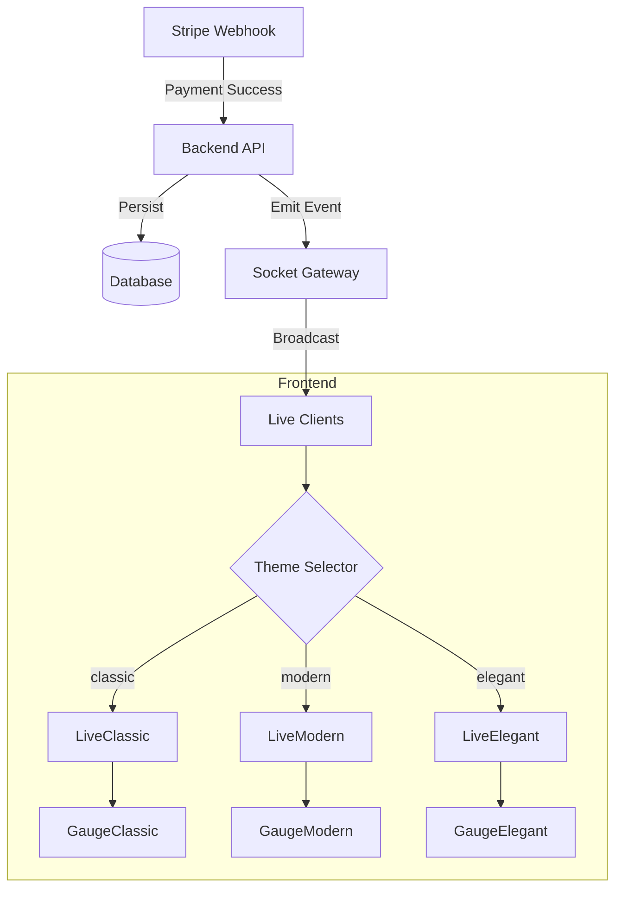

# Live Event & Real-Time Projection

## Overview

The Live Event feature is the public-facing "Projection Screen" typically displayed on large monitors during the fundraising event. It serves to:

1. Visualize the fundraising goal and progress (Gauge)
2. Display a real-time feed of incoming donations
3. Celebrate milestones with animations (Confetti)

## Feature Breakdown

### 1. Real-Time Updates

The screen connects to a WebSocket server to receive donation events instantly without page refreshes.

- **Frontend**: Connects via `socket.io-client`
- **Backend**: Broadcasts events via `SocketGateway`

### 2. Dynamic Configuration

The visual theme, goal amount, and labels are not hardcoded but loaded from the Event Configuration.

- **Source**: `event-config.json` (or database)
- **Adaptability**: Allows the same codebase to power different events (e.g., Gala vs. Charity Run)

### 3. Theme & Gauge Selection

Administrators can select from multiple visual themes and gauge styles:

| Theme | Description |
|:---|:---|
| **Classic** | Traditional layout with centered gauge |
| **Modern** | Bold, gradient-heavy design |
| **Elegant** | Minimalist, sophisticated look |

---

## Theme Variants

The Live Page supports three distinct visual themes, each with its own layout and styling:

### Classic Theme

```
┌─────────────────────────────────────────────────────┐
│  ┌─────────────────────────────────────────────┐    │
│  │               EVENT TITLE                    │    │
│  │           ╭──────────────╮                  │    │
│  │           │    GAUGE     │                  │    │
│  │           │   €25,000    │                  │    │
│  │           ╰──────────────╯                  │    │
│  │            Goal: €50,000                    │    │
│  └─────────────────────────────────────────────┘    │
│  ┌──────────────────┐  ┌──────────────────┐         │
│  │  Donation Feed   │  │     QR Code      │         │
│  └──────────────────┘  └──────────────────┘         │
└─────────────────────────────────────────────────────┘
```

**Component**: `LiveClassic.tsx`

### Modern Theme

```
┌─────────────────────────────────────────────────────┐
│  TITLE                                   ┌───────┐  │
│  ════════════════════════════════════    │  QR   │  │
│                                          └───────┘  │
│  ╔═══════════════════════════════════════════════╗  │
│  ║              €25,000 / €50,000                ║  │
│  ║  ████████████████████░░░░░░░░░░░░░░░░  50%   ║  │
│  ╚═══════════════════════════════════════════════╝  │
│                                                     │
│  ┌─────────────────────────────────────────────┐    │
│  │  RECENT DONATIONS (horizontal scroll)       │    │
│  └─────────────────────────────────────────────┘    │
└─────────────────────────────────────────────────────┘
```

**Component**: `LiveModern.tsx`

### Elegant Theme

```
┌─────────────────────────────────────────────────────┐
│                                                     │
│                    EVENT TITLE                      │
│                    ───────────                      │
│                                                     │
│                 ╭────────────╮                      │
│                 │   €25,000  │                      │
│                 │    ════    │                      │
│                 │   €50,000  │                      │
│                 ╰────────────╯                      │
│                                                     │
│           Recent                    ┌────┐          │
│           Donations                 │ QR │          │
│           ─────────                 └────┘          │
└─────────────────────────────────────────────────────┘
```

**Component**: `LiveElegant.tsx`

---

## Gauge Types

Three gauge styles are available, each providing a different visual representation of progress:

### GaugeClassic

A circular gauge with animated fill:

- Circular SVG with stroke animation
- Percentage text in center
- Amount display below gauge
- Goal label at bottom

**Location**: `apps/web/src/features/live/components/gauges/GaugeClassic.tsx`

### GaugeModern

A horizontal progress bar with gradient:

- Full-width progress bar
- Animated gradient fill
- Large numeric display above
- Percentage badge

**Location**: `apps/web/src/features/live/components/gauges/GaugeModern.tsx`

### GaugeElegant

A minimalist vertical gauge:

- Thin vertical bar
- Subtle animations
- Typography-focused design
- Muted color palette

**Location**: `apps/web/src/features/live/components/gauges/GaugeElegant.tsx`

---

## Configuration

### Event Settings

Theme and gauge selection is configured per-event:

```typescript
// Event settings schema
live: z.object({
  theme: z.enum(['classic', 'modern', 'elegant']).default('classic'),
}).optional()
```

### Admin UI

Administrators select the theme in the Event Settings page under the "Live Screen" section:

```
┌────────────────────────────────────┐
│  Live Screen Settings              │
├────────────────────────────────────┤
│  Theme                             │
│  ○ Classic   ● Modern   ○ Elegant  │
└────────────────────────────────────┘
```

---

## Implementation Details

### Frontend (`apps/web`)

#### Page & Components

- **`LivePage`** (`apps/web/src/features/live/pages/LivePage.tsx`):
  - The main container. Orchestrates the WebSocket connection and layout.
  - Dynamically renders the selected theme component.
  
- **`DonationFeed`**: A scrolling list of recent donations using `framer-motion` for entrance animations.

#### Theme Components

| File | Description |
|:---|:---|
| `LiveClassic.tsx` | Classic centered layout |
| `LiveModern.tsx` | Modern horizontal layout |
| `LiveElegant.tsx` | Elegant minimal layout |

#### Gauge Components

| File | Description |
|:---|:---|
| `GaugeClassic.tsx` | Circular SVG gauge |
| `GaugeModern.tsx` | Horizontal progress bar |
| `GaugeElegant.tsx` | Vertical minimal gauge |

#### Hooks

- **`useLiveSocket`**:
  - Manages the `socket.io` connection lifecycle
  - Listens for `donation.created` events and updates the local state
  
- **`useEventConfig`**:
  - Fetches the theme (colors) and content (titles) to style the page

### Backend (`apps/api`)

#### WebSocket Gateway (`GatewayModule`)

- **Technology**: `socket.io`
- **Events**:
  - **`joinEvent`** (Client → Server): Client subscribes to updates for a specific event room
  - **`donation.created`** (Server → Client): Broadcasted when a payment is confirmed

```typescript
interface DonationEventPayload {
  id: string;
  eventId: string;
  amount: number;     // cents
  donorName: string;
  message?: string;
  createdAt: string;
}
```

---

## Architecture



---

## CSS Variables

The Live Screen uses dedicated CSS variables for theming. See [White-Labeling > Live Screen Variables](../white-labeling.md#feature-live-screen) for the complete reference.

Key variables:

| Variable | Description |
|:---|:---|
| `--live-page-bg` | Page background color |
| `--live-gauge-track` | Gauge background track |
| `--live-gauge-shadow` | Gauge glow effect |
| `--live-feed-item-bg` | Donation feed item background |
| `--live-counter-size` | Main counter font size |

---

## Security & Configuration

### Configuration

- **`VITE_API_URL`**: The frontend connects to this URL. Ensure it matches the backend URL where the WebSocket gateway is running.

### Security

- **CORS**: The WebSocket gateway uses `CORS_ORIGIN` environment variable to restrict connection origins.
  - Development: defaults to `*` if not set (or typically `localhost`)
  - Production: MUST be set to the frontend's domain (e.g., `https://my-event.com`) to prevent unauthorized cross-site connections
