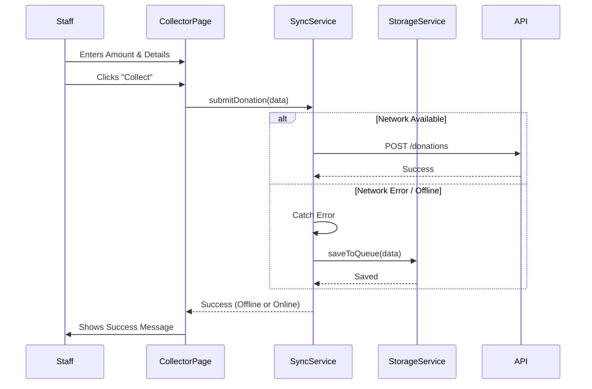
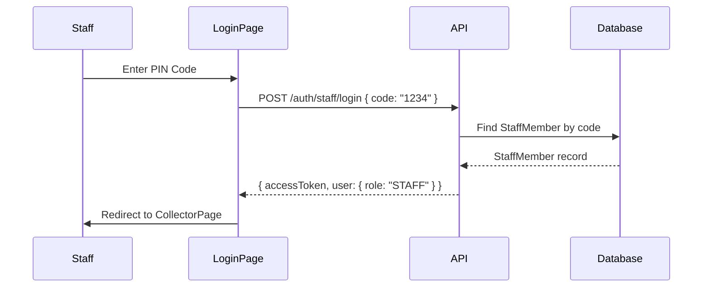

# Staff Offline Mode (Collector App)

## Overview

The Staff feature is designed for on-site volunteers and staff members to collect donations physically (cash, check, or assisted card entry). It prioritizes reliability, allowing operation in unstable network conditions via an Offline Queue.

## Feature Breakdown

### 1. Collector Interface

- **Keypad Entry**: Large, touch-friendly UI for quick amount entry.
- **Donation Types**: Toggles between Cash, Check, Pledge, and Other.
- **Donor Info**: Optional fields for Name and Email (for receipts).

### 2. Offline Synchronization

- **Queue**: Donations collected while offline are stored in `localStorage` via `StorageService`.
- **Sync**: When connectivity is restored, the `SyncService` pushes queued items to the API.
- **Feedback**: UI indicators show online/offline status and sync progress.

### 3. Staff Management

- **Global PIN Codes**: Staff members have unique PIN codes that work across all events.
- **Multi-Event Support**: Staff can be assigned to multiple events.
- **Performance Tracking**: Donations are linked to the staff member who collected them.

---

## Data Model

```prisma
model StaffMember {
  id        String   @id @default(uuid())
  code      String   @unique // PIN code (global)
  name      String   // Name of the volunteer
  events    Event[]  // Many-to-many with Events
  donations Donation[]
  createdAt DateTime @default(now())
  updatedAt DateTime @updatedAt
}

model Donation {
  // ... other fields
  staffMemberId String?
  staffMember   StaffMember? @relation(fields: [staffMemberId], references: [id])
}
```

---

## Implementation Details

### Frontend (`apps/web`)

#### Pages

- **`CollectorPage`** (`apps/web/src/features/staff/pages/CollectorPage.tsx`):
    - Main controller for the collector UI.
    - Handles keypad input state.
    - Integrates `SyncService` for submission.

#### Services

- **`sync.service.ts`**:
    - Handles `POST /donations` via the centralized `@core/lib/api` client.
    - Catches network errors and delegates to `StorageService` for queuing.
    - `processQueue()`: Retries pending items when back online.

- **`storage.service.ts`**:
    - Wrapper around `localStorage` using "staff_donation_queue" key.
    - Methods: `saveToQueue`, `getQueue`, `removeFromQueue`.

#### Components

- **`Keypad`**: Reusable numeric input grid.
- **`DonationTypeSelector`**: Toggle buttons for payment method.

### Backend (`apps/api`)

#### Endpoints

| Method   | Endpoint            | Description                          | Auth   |
| :------- | :------------------ | :----------------------------------- | :----- |
| `POST`   | `/auth/staff/login` | Staff PIN login                      | Public |
| `GET`    | `/staff`            | List all staff members               | Admin  |
| `POST`   | `/staff`            | Create new staff member              | Admin  |
| `PUT`    | `/staff/:id`        | Update staff details                 | Admin  |
| `DELETE` | `/staff/:id`        | Remove staff member                  | Admin  |
| `GET`    | `/staff`            | List all staff members               | Admin  |
| `POST`   | `/donations`        | Record donation (with staffMemberId) | Staff  |

#### Service (`StaffService`)

```typescript
// Key methods
async findAll(): Promise<StaffMember[]>
async findByCode(code: string): Promise<StaffMember>
async create(data: CreateStaffDto): Promise<StaffMember>
async update(id: string, data: UpdateStaffDto): Promise<StaffMember>
async delete(id: string): Promise<void>
async getStats(id: string): Promise<StaffStats>
```

---

## Data Flow (Offline)



---

## Authentication Flow



---

### Performance Tracking

Donations are linked to the staff member who collected them via the `staffMemberId` field on the Donation record. Admins can view these assignments in the Donation Export CSV or by filtering the Donation table.
