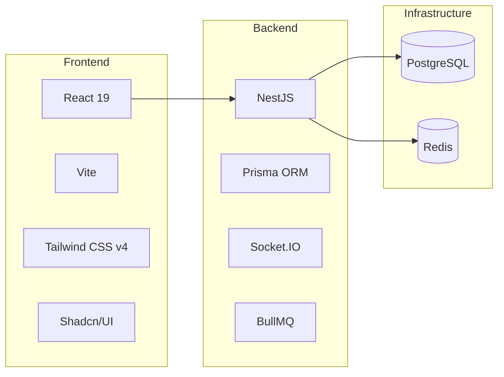

# Fundraising Event

[](https://github.com/Mouness/fundraising-event/blob/main/package.json)

Welcome to the documentation for the **Fundraising Event** platform — a real-time, white-label fundraising solution for physical and hybrid events.

## Overview

This project provides a complete fundraising ecosystem featuring:

- **Real-time Updates**: Live gauges and donation feeds powered by WebSocket
- **Multi-channel Collection**: Online payments (Stripe/PayPal) + offline collection (Cash/Check)
- **White-Label Ready**: Full theming, branding, and localization support
- **Open Source**: Designed for easy deployment and customization

---

## Quick Links

### Getting Started

| Document                                  | Description                        |
| :---------------------------------------- | :--------------------------------- |
| [Getting Started](getting-started.md)     | Installation and setup guide       |
| [Architecture](architecture.md)           | System components overview         |
| [Project Structure](project-structure.md) | Folder structure and organization  |
| [Configuration](configuration.md)         | Environment variables and settings |

### Core Documentation

| Document                              | Description                         |
| :------------------------------------ | :---------------------------------- |
| [API Reference](api-reference.md)     | REST endpoints and WebSocket events |
| [White-Labeling](white-labeling.md)   | Theming, CSS variables, and i18n    |
| [Providers Integration](providers.md) | External services configuration     |

### Quality Reports

| Document                                                                                           | Description                               |
| :------------------------------------------------------------------------------------------------- | :---------------------------------------- |
| [Unit Test Coverage (API)](../reports/unit/apps/api/coverage/index.html)                           | Technical coverage for the NestJS API     |
| [Unit Test Coverage (White-Labeling)](../reports/unit/packages/white-labeling/coverage/index.html) | Coverage for common packages              |
| [E2E Test Report](../reports/e2e/index.html)                                                       | Playwright full-stack integration results |

---

## Features

### Platform Features

| Feature               | Description                             | Documentation                         |
| :-------------------- | :-------------------------------------- | :------------------------------------ |
| **Authentication**    | Admin login, Staff PIN, OAuth           | [View →](features/authentication.md)  |
| **Events Management** | Create and configure fundraising events | [View →](features/events.md)          |
| **Global Settings**   | Platform-wide configuration             | [View →](features/global-settings.md) |

### Donor-Facing Features

| Feature                  | Description                 | Documentation                              |
| :----------------------- | :-------------------------- | :----------------------------------------- |
| **Donation Flow**        | Stripe & PayPal integration | [View →](features/donation.md)             |
| **Live Event**           | Real-time projection screen | [View →](features/live-event.md)           |
| **Public Landing Pages** | Campaign landing pages      | [View →](features/public-landing-pages.md) |

### Staff & Admin Features

| Feature             | Description                       | Documentation                       |
| :------------------ | :-------------------------------- | :---------------------------------- |
| **Admin Dashboard** | Management and analytics          | [View →](features/admin.md)         |
| **Staff Collector** | Offline donation collection       | [View →](features/staff.md)         |
| **Communication**   | Email receipts and PDF generation | [View →](features/communication.md) |

---

## Technology Stack



| Layer           | Technologies                                              |
| :-------------- | :-------------------------------------------------------- |
| **Frontend**    | React 19, Vite, Tailwind CSS v4, Shadcn/UI, react-i18next |
| **Backend**     | NestJS, Prisma, Socket.IO, BullMQ, pdfmake                |
| **Database**    | PostgreSQL                                                |
| **Cache/Queue** | Redis                                                     |
| **Payments**    | Stripe, PayPal                                            |

---

## Project Structure

```
fundraising-event/
├── apps/
│   ├── api/          # NestJS Backend
│   └── web/          # React Frontend
├── packages/
│   ├── types/        # Shared TypeScript types
│   └── white-labeling/  # Theming & configuration
├── docs/             # This documentation
└── docker-compose.yml
```

[View full project structure →](project-structure.md)

---

## Support

- **Issues**: [GitHub Issues](https://github.com/your-org/fundraising-event/issues)
- **Discussions**: [GitHub Discussions](https://github.com/your-org/fundraising-event/discussions)
