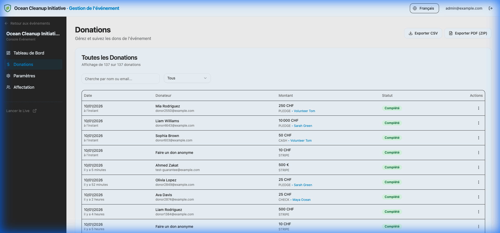
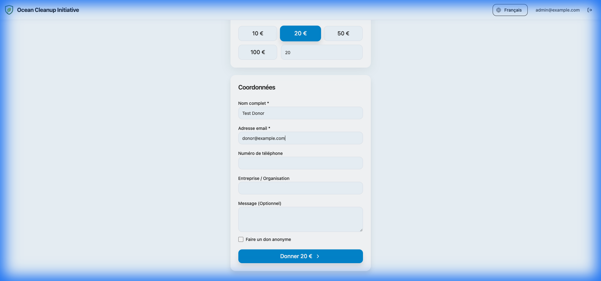
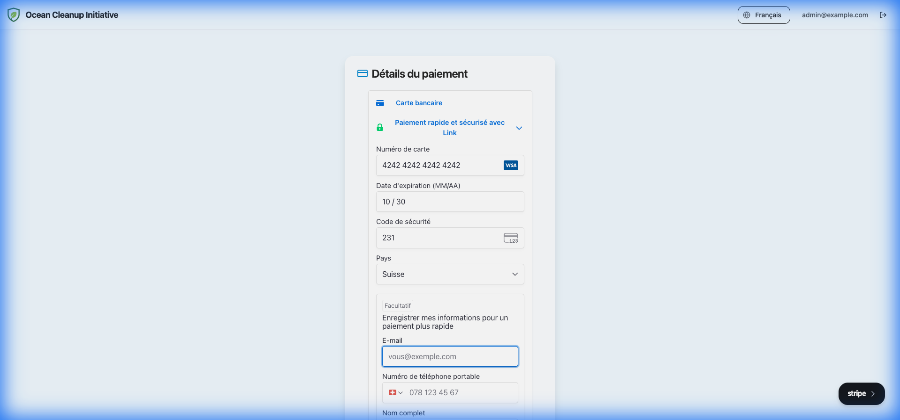

# Donations & Payments

This section covers how to track incoming funds and manage the financial aspect of your event.

## Donation Tracking

All transactions are recorded in the central database. You can view them in two places:

1.  **Global Dashboard**: Shows receipts from _all_ events.
2.  **Event Dashboard**: Shows only receipts for that specific campaign.

### filtering

You can filter the donation list by:

- **Date Range**
- **Status** (Succeeded, Pending, Failed)
- **Payment Method** (Stripe, PayPal, Cash, etc.)

### Table View

The donation table provides a detailed breakdown of each transaction:

- **Date**: When the donation occurred (hover for relative time).
- **Donor**: Name and email of the contributor.
- **Amount**: Value and payment method used.
- **Status**: Current processing state.
- **Actions**:
    - **Edit**: Update donor details (e.g., fix a typo in the name).
    - **Download Receipt**: Generate an individual PDF receipt.
    - **Cancel/Refund**: Refund the payment (if supported) and mark as cancelled.

## Receipts & Exports

The platform automatically generates PDF tax receipts for every successful donation. These documents are dynamically created using your **Global Branding** settings (logo, legal name, signature).

### PDF Generation

- **Automatic Email**: Receipts are attached to the confirmation email sent to the donor immediately after payment.
- **Manual Download**:
    1.  Locate the donation in the table.
    2.  Click the **Actions** (three dots) button.
    3.  Select **Download Receipt**.

### Bulk CSV & PDF Export

For accounting purposes, you can export data from the Event Dashboard:

1.  **Export CSV**: Downloads a spreadsheet of all transactions matching your current filters.
2.  **Export PDFs (ZIP)**: Generates a ZIP archive containing individual PDF receipts for all successful donations. This is useful for auditing or offline record-keeping.

## Payment Providers

To accept online payments, you must configure a payment processor. This is done in the **Global Settings**.

[View Global Payment Settings Guide](global_settings.md#5-payments)

> Ensure your payment keys are for the **Production** environment when running a real event. Test keys should only be used during setup.

## Donation Flow Guide

Here is the standard checkout flow your donors will experience.

### 1. Donor Information

Donors fill in their basic contact details.

_Example Data:_

- **Name**: `Test Donor`
- **Email**: `donor@example.com`

### 2. Payment Details

Donors choose their payment method and enter credentials.

_Test Credit Card (Stripe Mode):_

- **Card**: `4242 4242 4242 4242`
- **Exp**: `10/30`
- **CVC**: `123`
