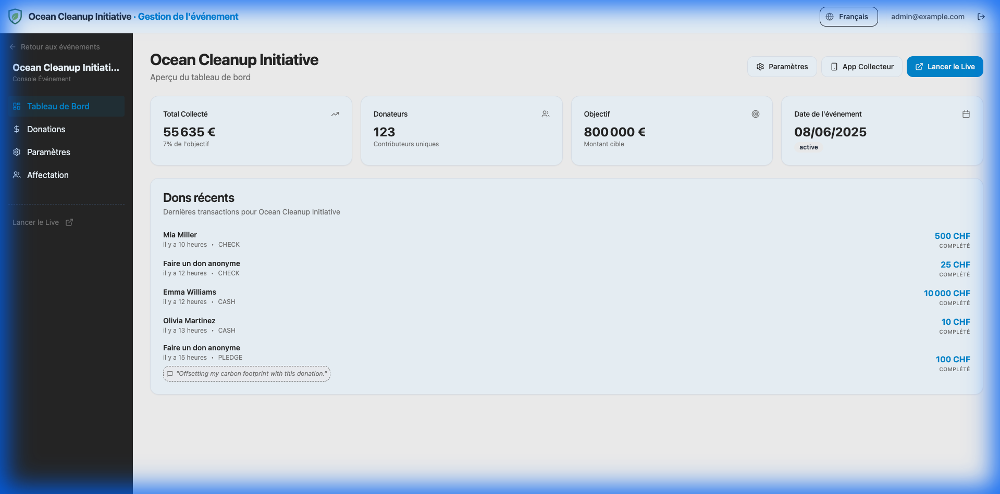
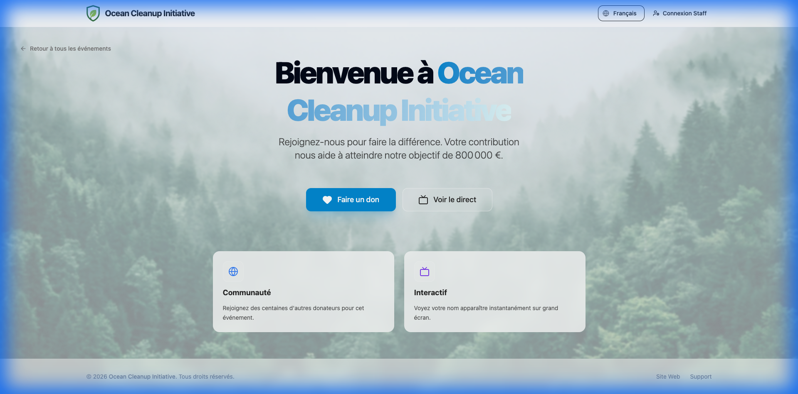
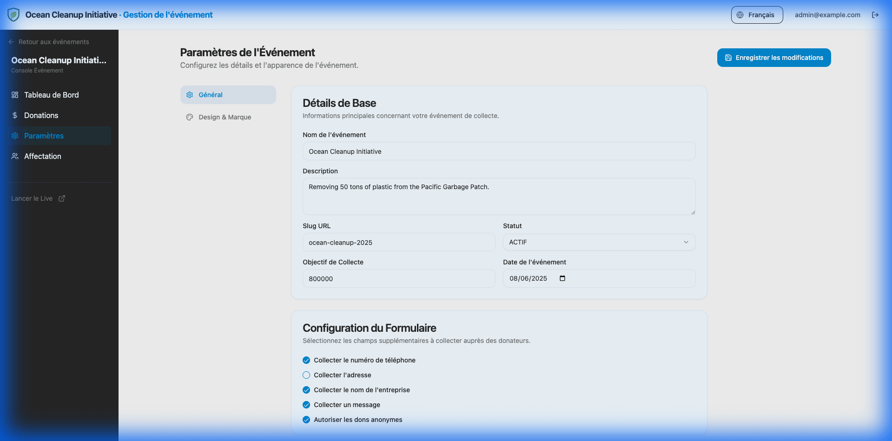
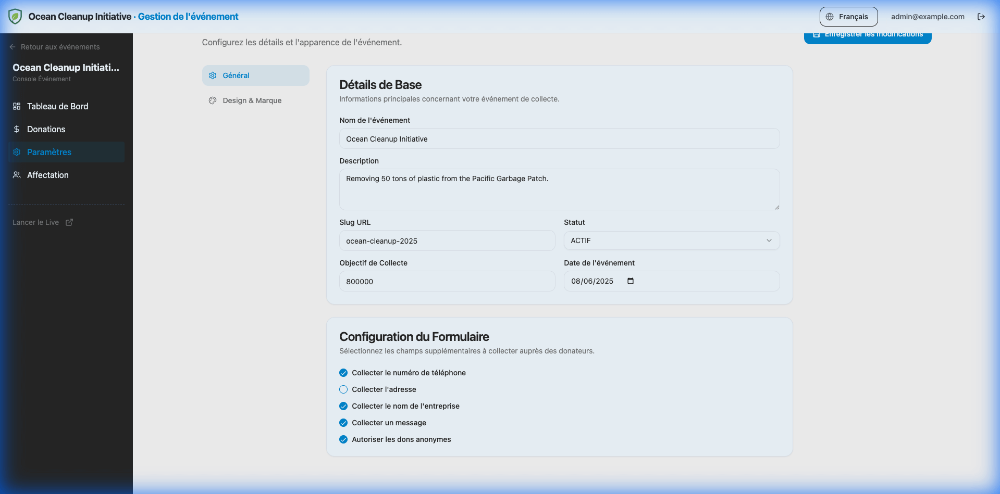
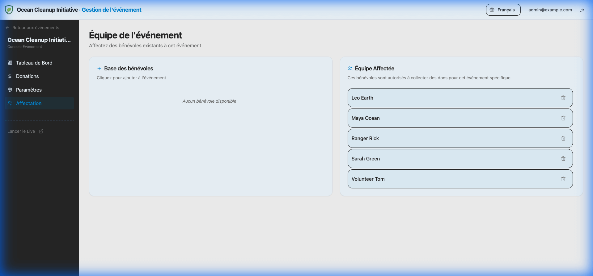

# Event Management

The core of the platform is the **Event**. Each fundraising campaign is treated as a distinct event with its own settings, goal, and branding.

## Creating an Event

1.  Navigate to the **Events** tab in the sidebar.
2.  Click the **"Create Event"** button.
3.  Fill in the basic details:
    - **Name**: The display name of your event (e.g., "Ocean Cleanup 2025").
    - **Slug**: The unique URL identifier (e.g., `ocean-cleanup-2025`). This will form your event URL: `http://localhost:5173/ocean-cleanup-2025`.
    - **Goal Amount**: Your fundraising target.

## Event Dashboard

Clicking on an event card takes you to that specific event's dashboard.

### Quick Actions

- **View Landing Page**: Opens the public donation page.

- **Launch Live Mode**: Opens the real-time display screen.
- **Event Settings**: Configure advanced options.

## General Settings

In the **Settings** tab of an event, you can configure the following:

### Basic Details

- **Description**: A short summary of the event (SEO friendly).
- **Date**: The scheduled date of the event.
- **Status**:
    - `Draft`: Only visible to admins.
    - `Active`: Publicly accessible and accepting donations.
    - `Closed`: Visible but donations are disabled.

### Form Configuration

Customize what information you collect from donors during the checkout process.

You can enable/disable:

- **Phone Number**
- **Physical Address**
- **Company Name**
- **Message** (Allow donors to leave a comment)
- **Anonymous Donations** (Allow donors to hide their name from public feeds)

> Keeping the form short increases conversion rates. Only enable fields you strictly need.

## Event Team & Staff Assignment

You can assign members from your **Global Staff Pool** to work on specific events. Assigned members can access the **Collector App** for this event using their PIN.

1.  Navigate to the **Team** tab in the Event Dashboard.
2.  **Assign Member**: Select a volunteer from the dropdown list.
3.  **Confirm**: The member is now authorized to collect donations for this event.

> [!NOTE]
> Only members already added to the Global Staff Pool (via the main Staff tab) will appear in the list. To add new volunteers, see [Staff Management](staff.md).
