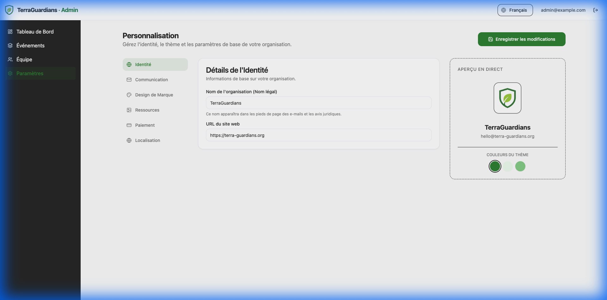
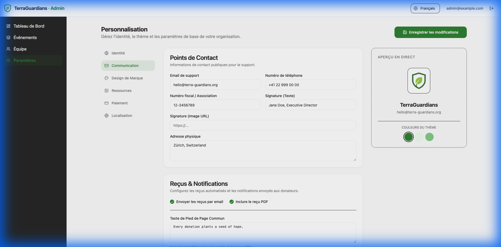
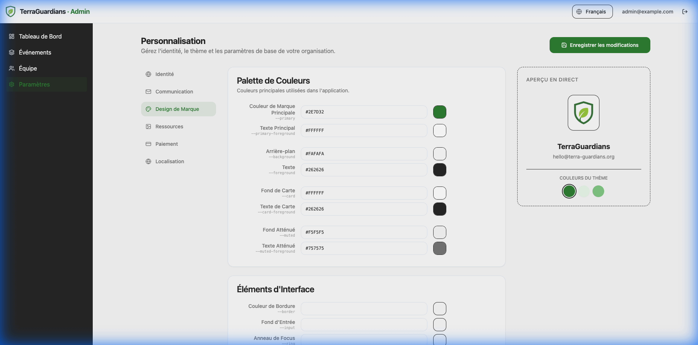
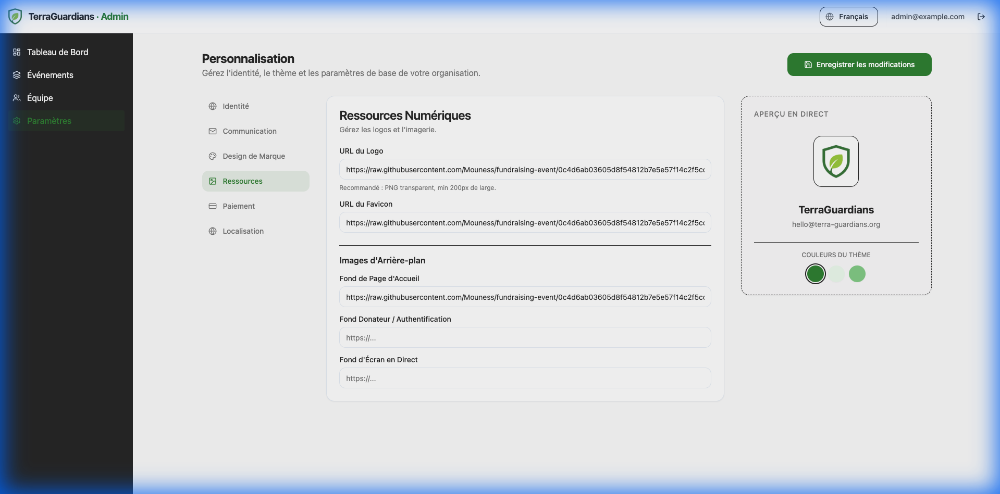
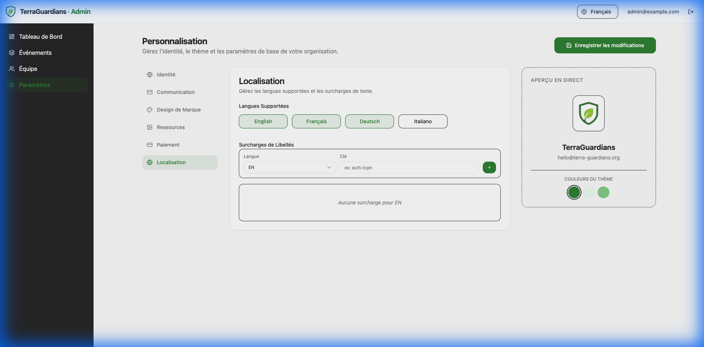

# Global Settings

The **Global Settings** area allows you to configure organization-wide defaults that apply to all your events. This ensures consistency and saves you time when creating new campaigns.

To access these settings, click on **Settings** in the main sidebar.

## 1. Identity

Configure your organization's core profile.

- **Legal Name**: Determines the default title for new events and the footer text.
- **Logo URL**: The default logo used across all events.
- **Support Email**: Where donors can reach you.
- **Website**: Your main organizational website.

## 2. Communication

Settings related to automated emails and receipts.

- **Sender Name**: The name donors will see in their inbox (e.g., "Ocean Cleanup Team").
- **Signature**: Text appended to the bottom of all emails.
- **PDF Receipts**: Enable or disable the automatic attachment of PDF tax receipts.

## 3. Theme & Design

Set the default color palette.

- **Primary Color**: Used for buttons, highlights, and key interactions.
- **Secondary Color**: Used for backgrounds or accents.
- **Custom Variables**: Advanced users can define CSS variables here to override specific design tokens. [See Technical Guide](../../technical/white-labeling.md#css-variables-reference) for a full list of available variables.

## 4. Assets

Manage global media resources.

- **Favicon**: The small icon displayed in the browser tab.
- **Default Backgrounds**:
    - _Donor Page_: Fallback image for donation forms.
    - _Live Screen_: Fallback image for the live dashboard.

## 5. Payments

Integrate your payment processors to accept donations.

- **Currency**: The default currency for all events (e.g., USD, EUR).
- **Stripe**: Click to configure credit card processing. Requires `Publishable Key` and `Secret Key`.
- **PayPal**: Click to configure PayPal payments. Requires `Client ID`.

## 6. Localization

Manage language and regional settings.

- **Default Locale**: The language users see when they first visit (e.g., English).
- **Supported Locales**: Check the languages you want to offer (English, French, etc.).
- **Overrides**: manually replace specific text strings for any language (e.g., renaming "Staff" to "Volunteers").
