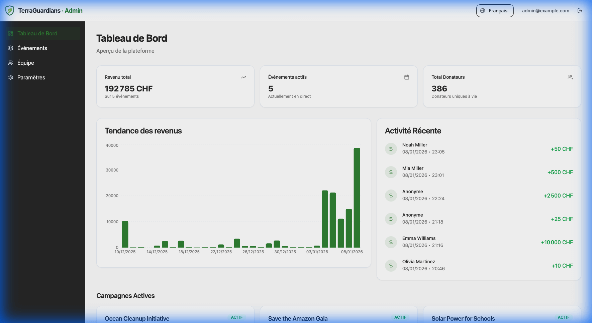

# Introduction

Welcome to the **Fundraising Event Platform User Guide**. This documentation is designed to help administrators and staff members effectively manage fundraising events, track donations, and engage with the community.

## Purpose & Philosophy

This platform was built with a single objective: **to empower NGOs and charities to focus on their mission, not their technology.**

We understand that fundraising events are high-energy, fast-paced environments where every second counts. Our goal is to streamline the entire donation lifecycle—from the first click on a landing page to the tax receipt in a donor's inbox.

### Key Benefits
-   **Centralized Management**: Control all your campaigns, donor data, and staff volunteers from one secure dashboard.
-   **Real-Time Engagement**: Our **Live Mode** turns fundraising into a collective experience, displaying donations instantly on big screens to build momentum and encourage more giving.
-   **Automated Compliance**: Tax receipts are generated and emailed automatically, reducing administrative overhead and ensuring happy donors.
-   **Trust & Transparency**: A professional, branded experience gives donors the confidence that their money is going exactly where it should.

## Accessing the Platform

The platform is divided into two main areas:

1.  **Public Interface**: Accessible to donors and the general public.
2.  **Admin Dashboard**: Restricted to organization administrators.

### Login URL
To manage your events, navigate to the Admin Login page:

- **URL**: `http://localhost:5173/login` (Local Development)
- **Production URL**: *(Your deployed domain)*

> [!NOTE]
> If you are an event staff member (volunteer), please ask your administrator for the specific **Staff Login** link for your event.

## Dashboard Overview

Once logged in, you will be greeted by the **Global Dashboard**.

### Key Features
- **Total Revenue**: Aggregate of all donations across all events.
- **Active Events**: Quick access to your ongoing campaigns.
- **Recent Activity**: A real-time feed of the latest donations and system events.

## Navigation

- **[Events](events.md)**: Create and manage individual fundraising campaigns.
- **[Staff](staff.md)**: Manage global staff members and volunteers.
- **[Settings](global_settings.md)**: Organization-wide defaults (Branding, Payments).
- **[Donations](donations.md)**: Understanding the donation flow.
- **[Live Mode](live.md)**: Setup the live dashboard screen.
