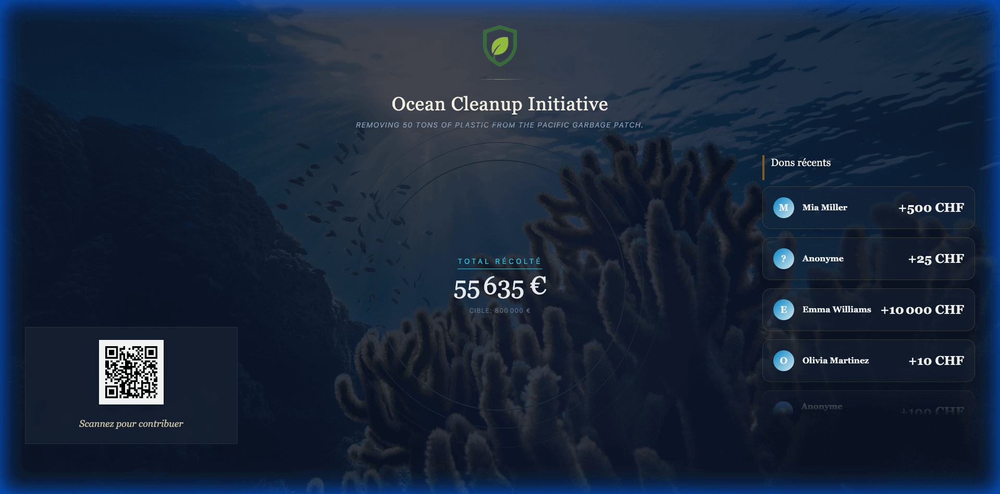

# Live Mode

The **Live Mode** is a dedicated display designed to be projected on large screens during your event. It builds momentum by visualizing fundraising progress in real-time.

## Launching Live Mode

1.  Go to your **Event Dashboard**.
2.  Click the **"Live Screen"** button or navigate to `/[event-slug]/live`.
3.  **Full Screen**: Press `F11` (or your browser's full-screen key) for the best experience.

## Features

### 1. Progress Gauge
A large, animated gauge shows the current total raised against the event goal. It updates instantly whenever a new donation is processed (online or via staff).

### 2. QR Code
A dynamic QR code is displayed on-screen. Attendees can scan this code with their smartphones to be taken directly to the **Donation Page** with the event pre-selected.

### 3. Recent Donations
A scrolling ticker or list displays the names and amounts of the most recent donors.
-   *Anonymous donations* will appear as "Anonymous".

### 4. Notifications
When a large donation occurs, a celebration animation (confetti or notification card) will momentarily take over the screen to recognize the donor.

## Customization

The look of the Live Mode is determined by the **Live Page Theme** selected in **Event Settings > Design & Branding**.
