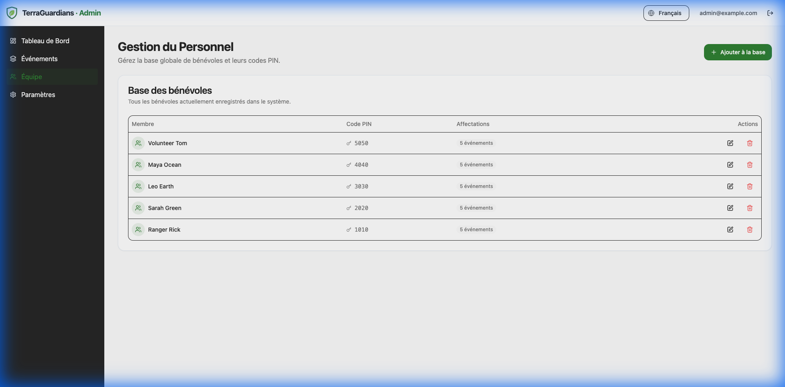
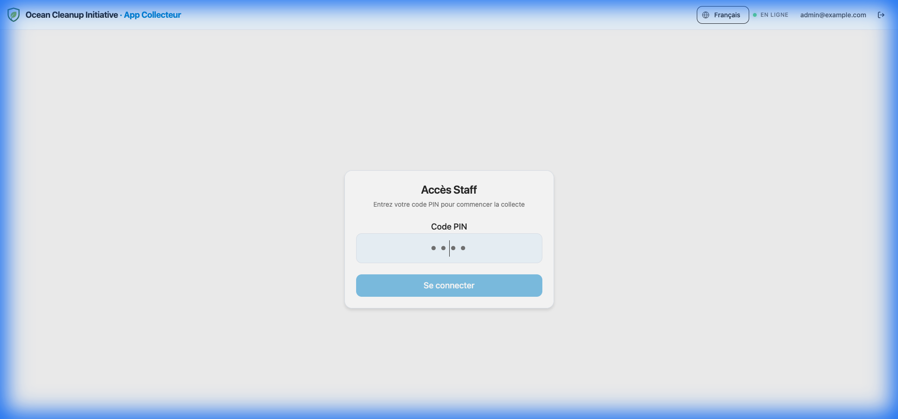
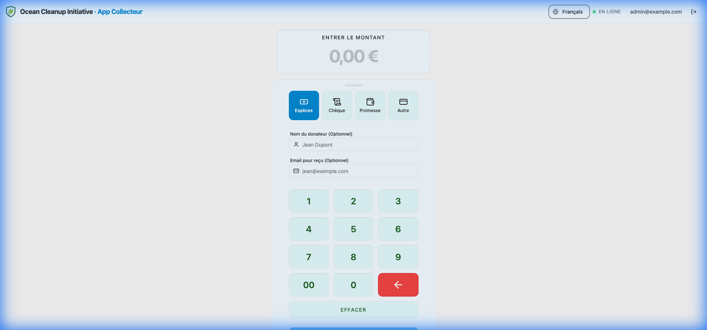

# Staff & Volunteers

Effectively managing your team is crucial for on-site fundraising. The platform provides role-based access to ensure security and ease of use.

## Role Types

- **Administrator**: Has full access to the Admin Dashboard, global settings, and all events.
- **Staff (Volunteer)**: Has restricted access. They can only access the **Collector App** to process donations on behalf of others.

## Managing Staff

1.  Navigate to the **Staff** tab in the main sidebar.
2.  **Add Member**: Click to register a new volunteer.
3.  **PIN Code**: Each staff member is assigned a unique PIN code. This is used for quick authentication in the Collector App if configured.

> [!TIP]
> This section manages the **Global Pool**. To assign these members to a specific campaign, go to that event's dashboard and use the **Team** tab. [See Event Team Guide](events.md#event-team--staff-assignment).

## Collector App

The Collector App is a simplified interface designed for volunteers at the event venue to collect donations quickly via tablet or mobile.

### 1. Access & Login

Navigate to `[event-url]/staff/login` (e.g., `/ocean-cleanup-2025/staff/login`).

1.  Enter your **4-digit PIN** code (assigned in the Admin Panel).
2.  Click **Login**.

> [!NOTE]
> Example PIN: `1010` (or check your staff profile).

### 2. Dashboard

Once logged in, volunteers see a streamlined dashboard to process donations without accessing sensible admin features.

### Accessing the App

1.  Open the event URL on the device: `http://localhost:5173/ocean-cleanup-2025`
2.  Click **"Staff Login"** (or "**Connexion Staff**" in French) in the footer.
    - _Note_: The Admin login is located on the root landing page.
3.  Enter credentials to start collecting donations.

### Workflow

1.  **Select Payment Method**: Cash, Check, or Card (via terminal).
2.  **Enter Donor Details**: Name and Amount.
3.  **Confirm**: The donation is instantly recorded and appears on the Live Screen.
