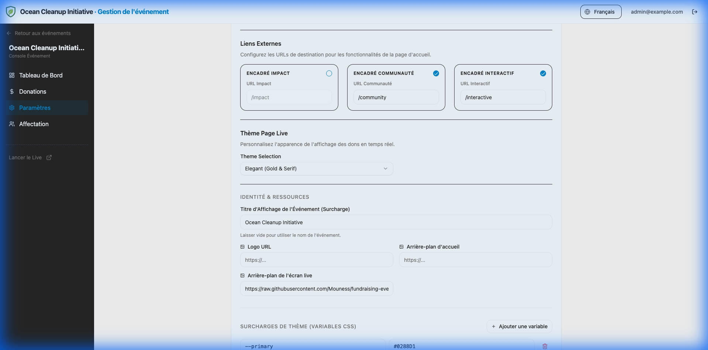
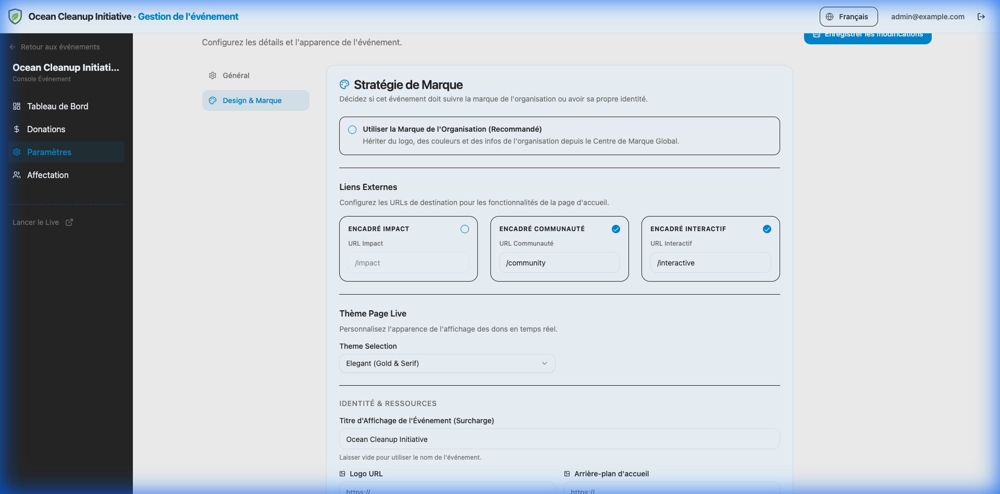
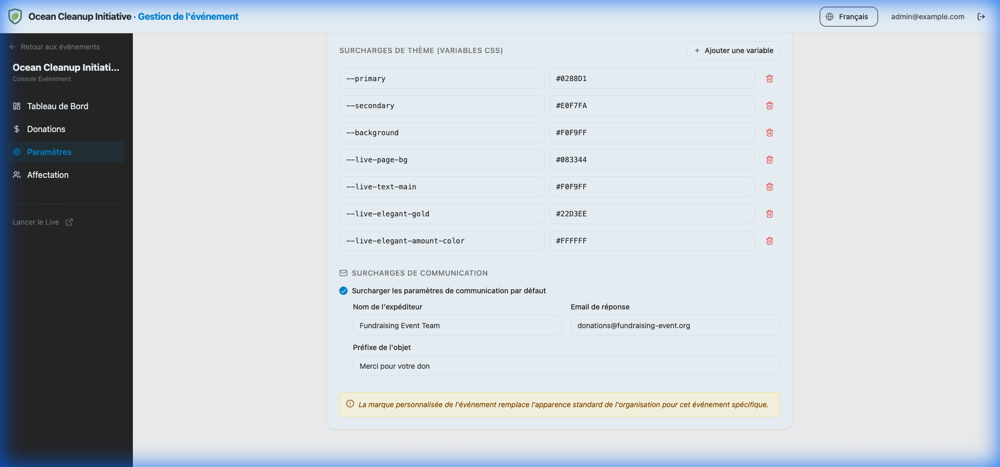

# Design & Marque

Assurez-vous que la page de votre événement correspond à votre identité visuelle.

## Paramètres de Marque

Accédez à **Paramètres > Design & Marque** dans le tableau de bord de votre événement.

- **Logo de l'Événement** : Remplace le logo global de l'organisation pour cet événement spécifique.
- **Arrière-plan Landing** : L'image d'arrière-plan pour la page de don.
- **Arrière-plan Écran Live** : L'image d'arrière-plan pour le tableau de bord en temps réel.

> [!TIP]
> **Chemins Relatifs** : Pour les ressources internes hébergées sur la plateforme, vous pouvez utiliser des chemins relatifs comme `/assets/images/mon-bg.jpg` au lieu d'URLs complètes.

## Liens de la Page d'Accueil

Vous pouvez personnaliser les boîtes de ressources externes affichées sur la page d'accueil de l'événement.

- **Impact** : Lien vers votre rapport d'impact ou mission.
- **Communauté** : Lien vers un groupe communautaire (ex: Discord, Facebook).
- **Interactif** : Lien vers une expérience interactive ou une autre ressource.

Utilisez les **cases à cocher** pour activer ou désactiver chaque carte. Si désactivée, la carte sera complètement masquée sur la page publique.

> [!NOTE]
> La page d'accueil utilise une grille dynamique. Elle s'ajustera automatiquement de 3 colonnes à 2 ou 1 colonne selon le nombre de boîtes activées.

## Détails Techniques

Pour les développeurs ou administrateurs avancés cherchant à comprendre la structure de configuration sous-jacente (schéma JSON, interfaces TypeScript) du système de marque blanche, veuillez consulter la documentation technique.

[Lire le Guide Technique White-Labeling](../../technical/white-labeling.md)

## Thème de la Page Live

Personnalisez l'apparence de l'affichage des dons en temps réel (page `/live`).

- **Moderne** : Un design épuré, idéal pour les écrans professionnels.
- **Classique** : Un look traditionnel et robuste.
- **Élégant** : Un design premium avec des touches dorées.
